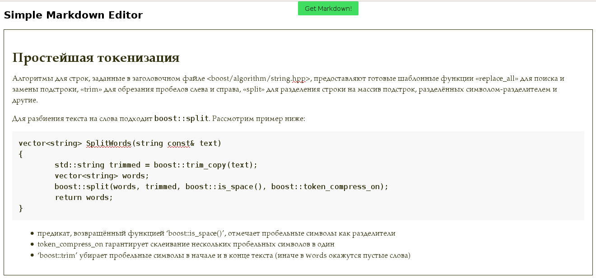

Working prototype of Markdown editor based on ready-to-use components:

* [sofish/pen](https://github.com/sofish/pen) - JS library for WYSIWYG rich text editing
* [purecss.io](https://purecss.io/) - very simple CSS framework

Other components I still didn't use:

* [showdown](https://github.com/showdownjs/showdown) - a Markdown converter written in Javascript
* [fontawesome](http://fontawesome.io/) - easy to use icons set

It's my pet project, don't expect to see high quality editor =)

